# WhoLetMeCook

### Description:

The WhoLetMeCook Web Application is a full-stack web application built using React.js for the frontend and Node.js with Express.js for the backend. It allows users to explore a variety of recipes, rate them, and leave reviews.

### Features:

1. Browse Recipes: Users can explore a collection of recipes displayed in a grid layout.
2. Recipe Details: Users can view detailed information about each recipe, including its title, description, ingredients, and instructions.
3. Ratings: Users can rate recipes and view the average rating for each recipe.
4. Reviews: Users can leave reviews for recipes and see reviews left by other users.
5. Pagination: Recipes are paginated to enhance the browsing experience.
6. Authorization: Certain actions, such as adding reviews or ratings, require users to be authenticated.
7. Sorting: Recipes are sorted based on their average rating to showcase the most popular recipes first.

Technologies Used:

- Frontend: React.js, Axios, Tailwind CSS
- Backend: Node.js, Express.js, MongoDB
- Authentication: JSON Web Tokens (JWT)
- Database: MongoDB Atlas

## Screenshots

### Starting page
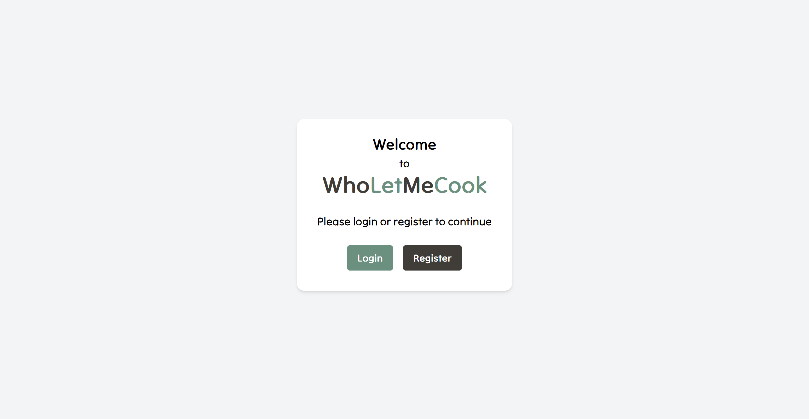

### Register page
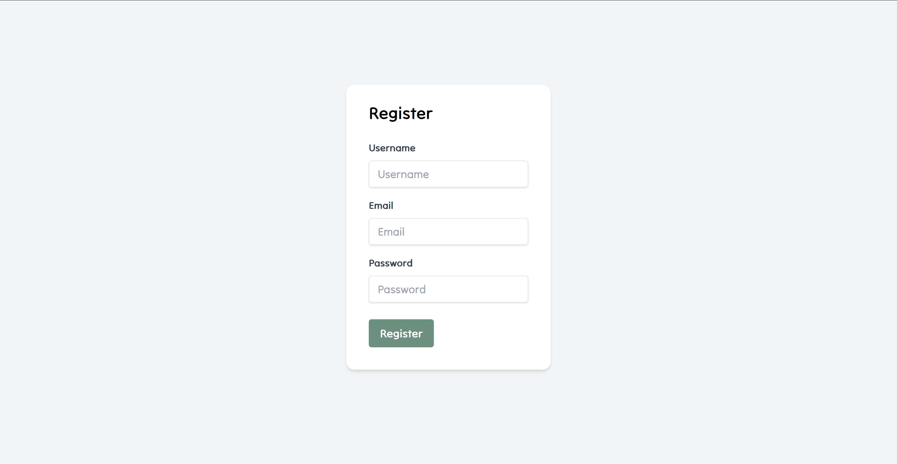

### Login page
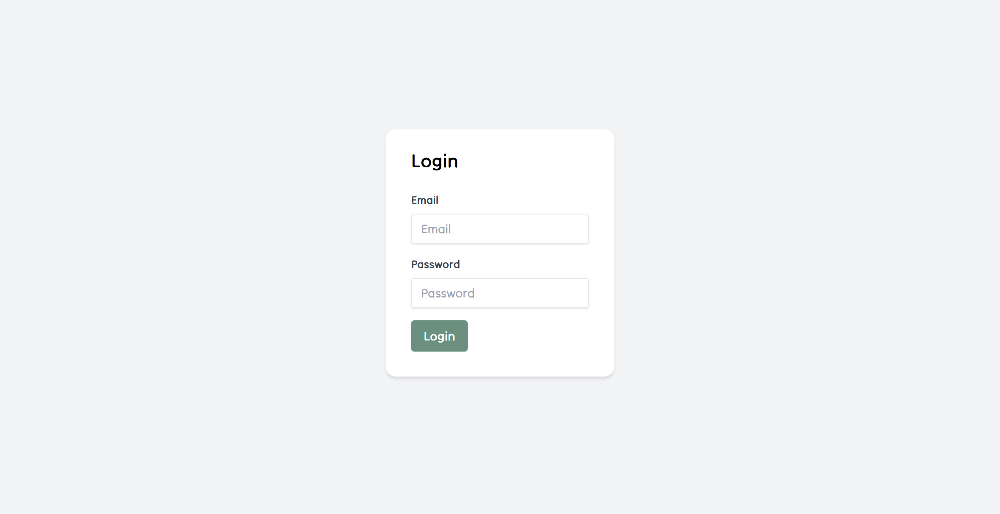

### Browse Recipes
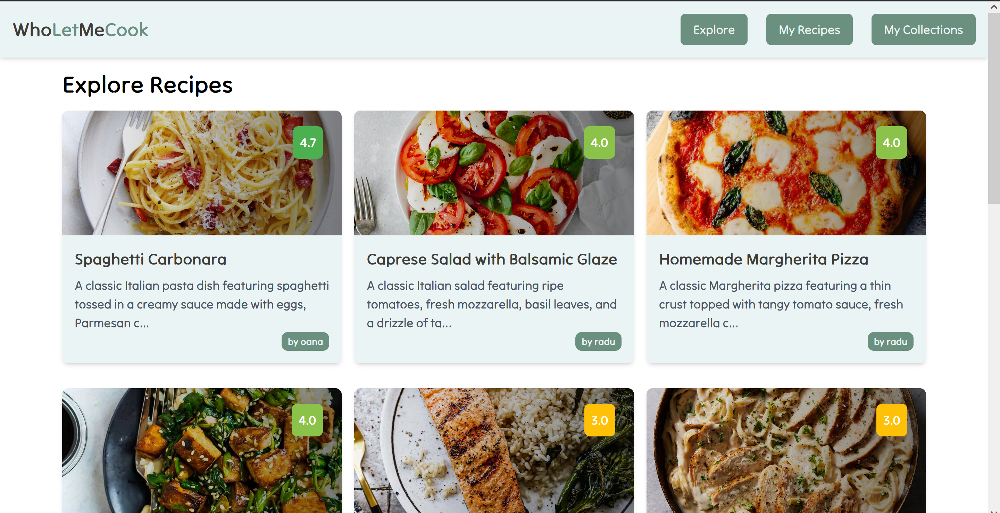

### Pagination
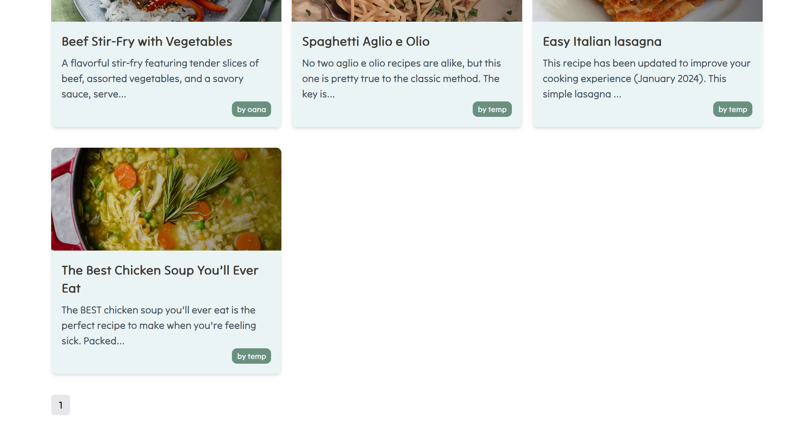

### Recipe Creator
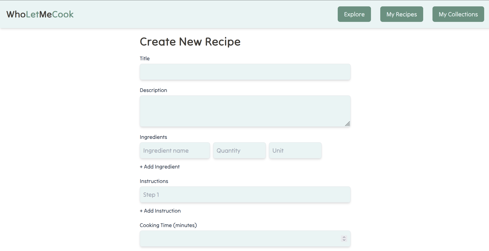

### Recipe Details
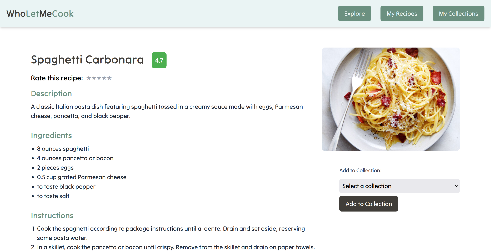

### Collections
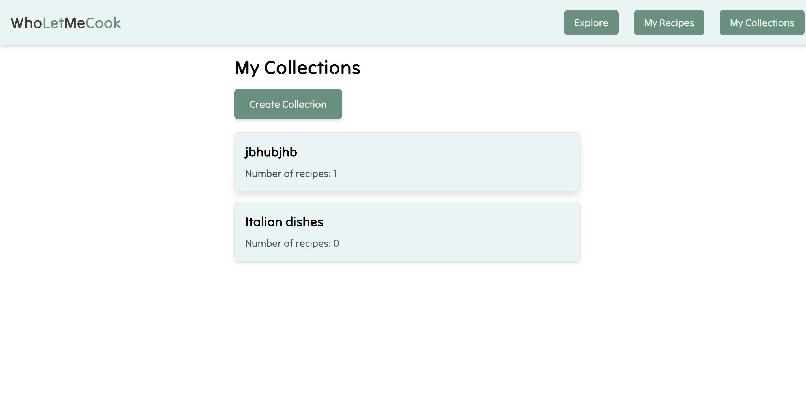

### Ratings
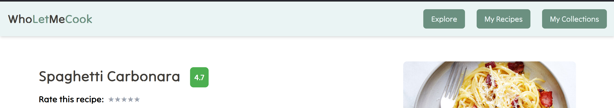

### Reviews
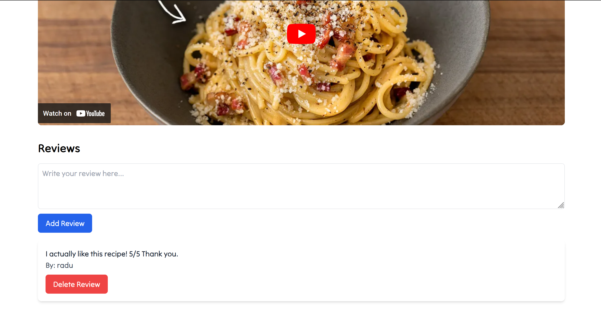

### Mobile Responsive
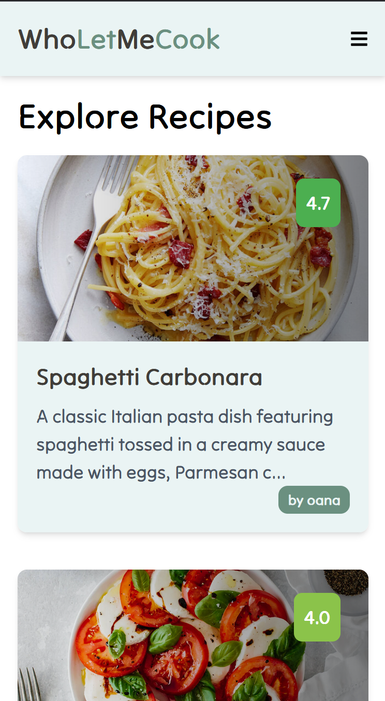
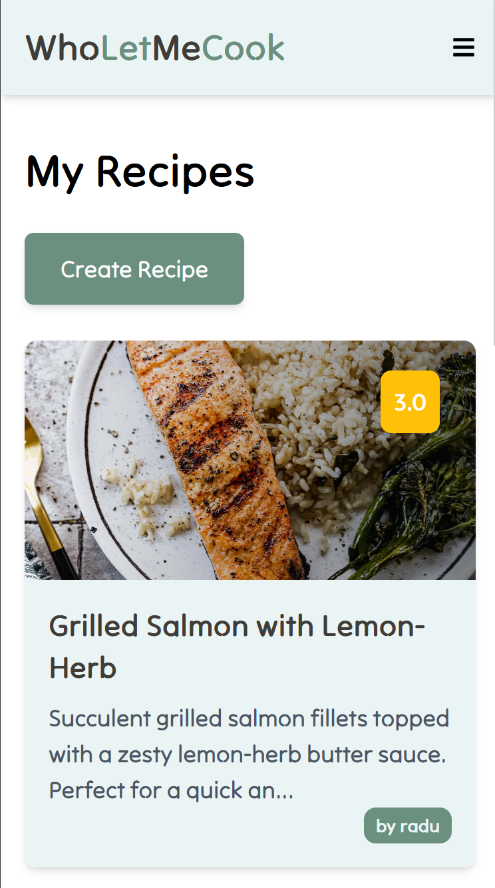
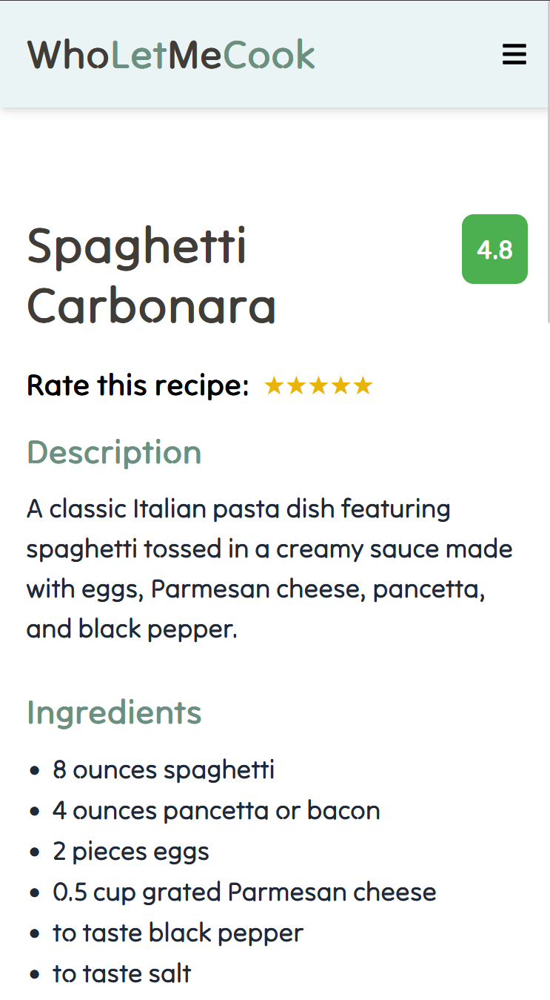
